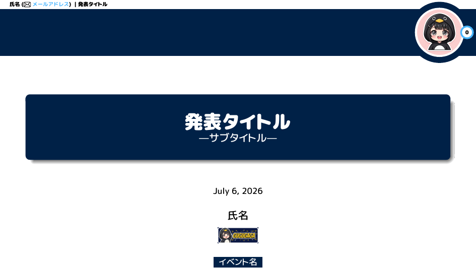
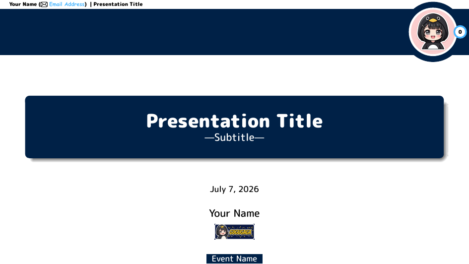
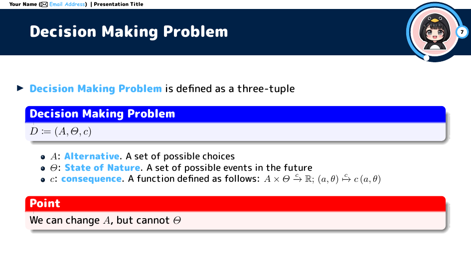
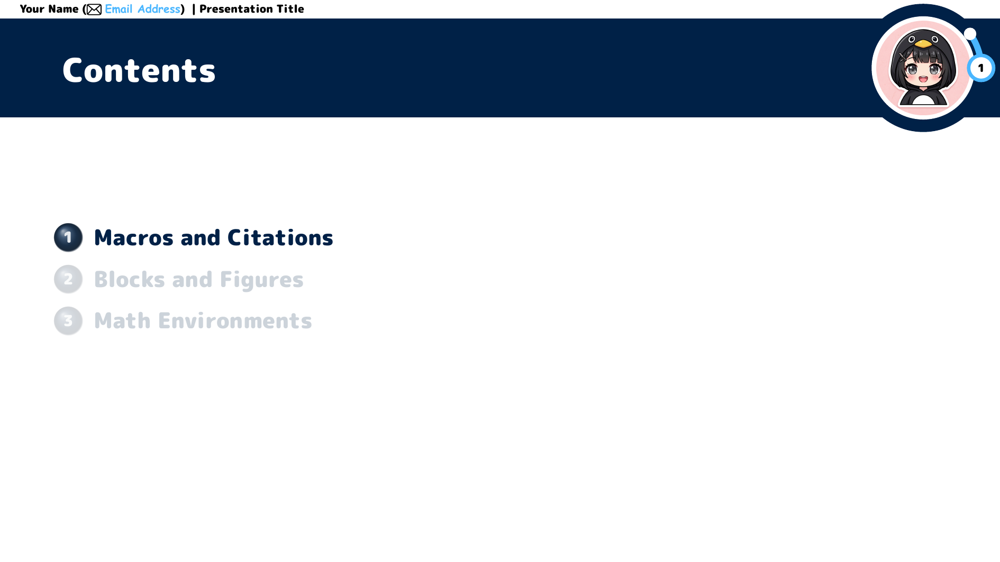

# slide-template

[](https://github.com/mukoubuchi/slide-template/actions/workflows/build.yml)
[](LICENSE)


XeLaTeX + Beamer presentation slide templates (16:9) with switchable color
themes (Oxford Blue by default), a header band, and a circular progress
indicator with a bold frame number in the top-right corner.

<p align="center">
  
  
  
  
</p>

| Directory | Description |
| --- | --- |
| [`tex/template-ja/`](tex/template-ja/) | Japanese template (README and comments in Japanese) |
| [`tex/template-en/`](tex/template-en/) | English template, frame-for-frame parallel to the Japanese one |

## Quick start

```sh
cd tex/template-en   # or tex/template-ja
latexmk              # build slide.pdf with XeLaTeX + bibtex
latexmk -c           # remove intermediate files
```

To start a new talk, copy the whole template folder and edit the
"presentation info" block at the top of `slide.tex`. See each template's
README for details.

Prebuilt PDFs (`slide-ja.pdf` / `slide-en.pdf`) are attached to each
[release](https://github.com/mukoubuchi/slide-template/releases), so you can
preview both templates without a TeX installation.

## Theme colors

The color scheme (base + accent) is selected with `\slidetheme{...}` in the
preamble of `slide.tex`:

```latex
\usepackage{slidestyle}
\slidetheme{agu} % omit for the default (oxford)
```

| Theme | Base | Accent |
| --- | --- | --- |
| `oxford` (default) | Oxford Blue `#002147` | Cerulean Blue `#49B6FF` |
| `agu` | Aoyama Gakuin dark green `#025F3D` | blue-green `#00A384` |
| `cambridge` | Dark Teal `#133844` | Cambridge Blue `#8EE8D8` |
| `mit` | MIT Red `#A31F34` | Silver Gray `#8A8B8C` |
| `princeton` | Black `#000000` | Princeton Orange `#E77500` |

All values come from each university's official palette (or, for Aoyama
Gakuin, from its official logo assets). To add a theme, define two colors
`<name>Primary` / `<name>Accent` in §2 of `slidestyle.sty`.

## Continuous integration

GitHub Actions ([`build.yml`](.github/workflows/build.yml)) builds both
templates on every pull request, checks Japanese/English structural parity,
validates PDF page count and page size, and renders every page to PNG for
smoke testing. The workflow uploads the built PDFs, LaTeX logs, and rendered
pages as artifacts.

When a `v*` tag is pushed, the workflow syncs release notes from
`.github/release-notes/<tag>.md` if present and attaches the built PDFs to the
release.

## Requirements

- TeX Live (XeLaTeX and `latexmk`)
- Fonts: uses **Rounded-X Mgen+** if installed, with the regular face pinned
  to `medium` and bold text pinned to `black`; otherwise falls back to
  **Hiragino Maru Gothic ProN** (bundled with macOS). The monospace font
  falls back from Comic Sans MS to Menlo. On non-macOS systems, adjust §1
  of `slidestyle.sty` to fonts available on your machine

## Features

- Five switchable color themes (see [Theme colors](#theme-colors) above);
  adding your own takes two `\definecolor` lines
- Title page with a rounded title box, affiliation logo, and an optional
  "# event name" ribbon
- Header with author, e-mail, and title; the e-mail becomes a mailto link
  only after you replace the placeholder with a real address
- Progress circle showing the current frame number over an arc, with the
  number rendered in the same bold face as headings
- Automatic table-of-contents slides at each `\section`, including bold
  section-number markers
- Emphasis macros, badges, keystroke rendering, jump buttons, block
  environments (incl. exercise/assignment), and TikZ samples
- Citations as superscript numbers; the References frame lists only cited
  entries

## Credits

The title page, header, and progress circle are merged and simplified from
the [AAU Simple Beamer Theme](https://github.com/jkjaer/aauLatexTemplates)
v1.3.2 (© 2014 Jesper Kjær Nielsen, GPL v3+) in §3 of `slidestyle.sty`.

## License

This project is licensed under the
[GNU General Public License v3.0 or later](LICENSE) (`GPL-3.0-or-later`).
